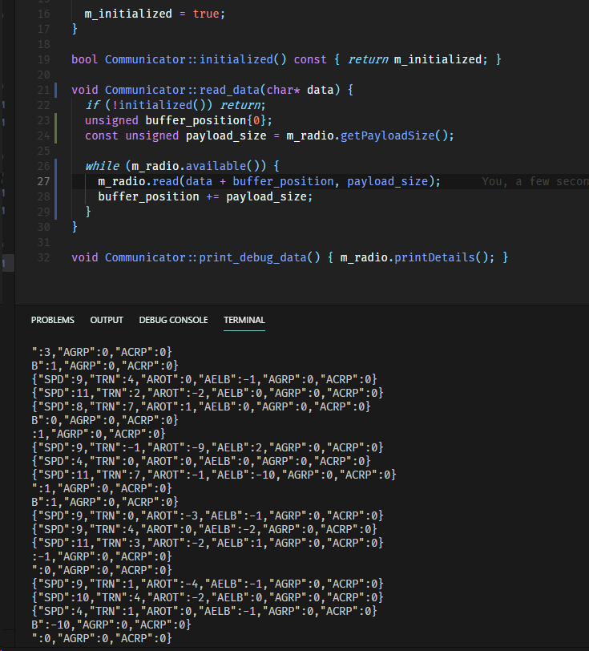

# Communication description and why is it problematic

Communication is most important part of this project, and since it's wireless, it can make some problems.

## Communication module restrictions

Module of choice is nRF24L01+, which allows to send data with speeds up to 2Mbps (with CRC verification and ACK). Generally it's a pretty good module, but one thing that can cause issues is the packet size. Maximum packet size is 32 bytes, and this restriction makes whole communication process more complicated than it should be.

### Working with 32-byte packets

Since the data representation of choice is JSON, single communicate can be quite long. In case of this remote, it's around 53 up to 71 bytes long, so it can fit in 2 to 3 packets. However, just sending the packets one-by-one is not a perfect solution (even with code that handles communicates longer than 32 bytes), because if I try it, this happens:

After some testing and tinkering with data rates, i've only got worse results, and this is not acceptable. I need to find a solution for this.

### Potential solutions

Three ideas that came to my head are:

1. **Implement UDP-like communication** - I'd have to stick a number and flag to every packet (or send it separately) containing it's length and information if it's last packet in communicate. Not so easy, not so performance-wise good, and i don't think that it would fix packet losses.

2. **Put all readings in different data format** so it won't be longer than 32 bytes. This is a sure solution, but i'd either have to use messagepack or my own data format. Doable, but i'd prefer sticking to JSON.

3. **Keep tinkering** - I only tried changing baud rates, so i still have few options, like manual ACK, or trying different packet sizes and even manual nRF24 handling. For now, i will stick to that.