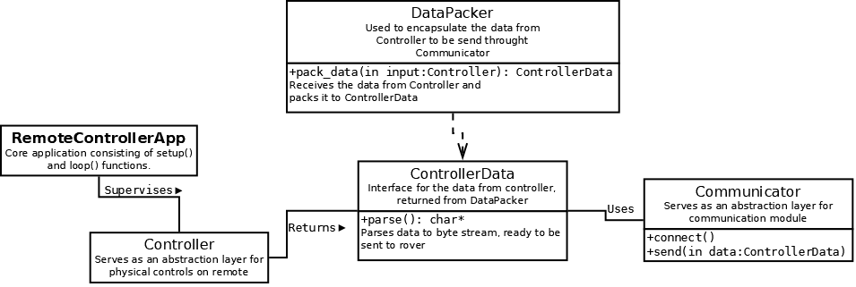

# Modularity of software

In this document, I will describe software architecture for remote controller, and how I want to achieve modularity and expandability.

## Core modules description

Remote electonically consists of

* Controls - knobs, joypads and buttons
* Communication module

Those are the two main abstractions i'm going to need in order to separate the implementation properly.

### Controls

For the controls, i'm not really going to need much abstraction because in case of this physical remote, it won't change. However, abstracting whole controlling layer is mandatory, in order to allow other solutions to be created, for example PC applications.

### Communication

This is the most important part of whole remote. Comms have to be standarized. I can separate two parts of abstraction for them:

* Data format
* Communication method

The latter will be an abstraction of some kind of communication device, which will allow to change the comms module or protocol when needed.

Data format has to be completely independent from the hardware, and in the best case scenario, existing data format (JSON, MessagePack) should be used to make implementation on other platforms easy. Hovewer, due to communication and processing power constrains, custom data format can be created.

## Implementation

Considering the above description, I've came up with following class diagram

This is generalized program structure and final implementation might slightly differ from it, but the point is to separate core modules into interfaces to allow easy maintenance and modifications.

Most important thing for me is the `DataPacker` and `ControllerData`, which - as mentioned above - have to be 100% separated from hardware and the rest of code, to allow re-usage of those interfaces and possible implementations on different platforms.

Code structure described above, with exception of `RemoteControllerApp`, have to be written in pure C++ and able to compile on any platform.